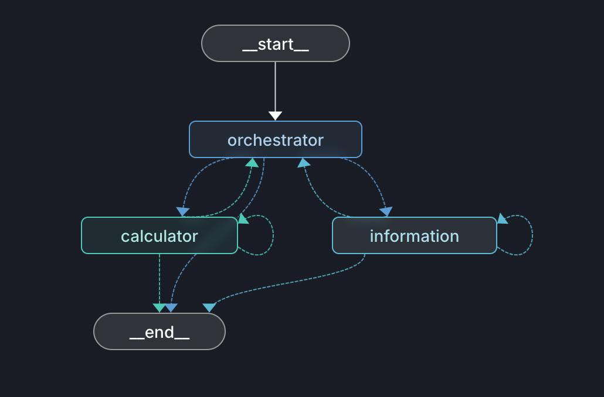

# LangGraph Multi-Node Agent System

A LangGraph-based agent system featuring multiple specialized nodes orchestrated through a central coordinator node. Each node is equipped with its own set of tools to handle specific tasks within the workflow.

## Overview

This project implements an agent architecture where:

-   An **orchestrator node** serves as the entry point and coordinates the workflow
-   Multiple **specialized nodes** handle specific tasks, each with their own toolset
-   Nodes currently execute **sequentially** in a defined order

## Current Architecture



### Sequential Execution

Currently, nodes execute one after another in a predefined sequence. Each node completes its entire execution before passing control to the next node.

## Roadmap

### Next Steps: Parallel & Sequential Execution

The next major enhancement will introduce a hybrid execution model:

#### Parallel Execution (Within a Single Node)

-   Tools within the same node will execute **in parallel**
-   This allows concurrent processing of independent tasks
-   Improves performance when multiple tools can run simultaneously

#### Sequential Execution (Across Different Nodes)

-   When tools from different nodes are required, execution will remain **sequential**
-   Ensures proper data flow and dependencies between nodes
-   Maintains logical order when cross-node coordination is needed

### Future Architecture

```
┌─────────────────┐
│   Orchestrator  │
└────────┬────────┘
         │
         ↓
    ┌────────┐
    │ Node 1 │ → [Tool 1.1 ║ Tool 1.2 ║ Tool 1.3]  ← Parallel
    └───┬────┘
        │ Sequential
        ↓
    ┌────────┐
    │ Node 2 │ → [Tool 2.1 ║ Tool 2.2]  ← Parallel
    └───┬────┘
        │ Sequential
        ↓
    ┌────────┐
    │ Node N │ → [Tool N.1 ║ Tool N.2 ║ Tool N.3]  ← Parallel
    └────────┘
```

## Installation

```bash
# Clone the repository
git clone <repository-url>
cd <project-directory>

# Create virtual environment
python -m venv venv
source venv/bin/activate  # On Windows: venv\Scripts\activate

# Install dependencies
pip install -r requirements.txt
```

## Usage

```python
# Example usage will be added here
```

## Project Structure

```
.
├── nodes/              # Node implementations
├── tools/              # Tool definitions
├── orchestrator/       # Orchestrator logic
├── config/             # Configuration files
└── main.py            # Entry point
```

## Technologies

-   **LangGraph**: Agent workflow orchestration
-   **Python**: Core programming language
-   Additional dependencies listed in `requirements.txt`

## Contributing

Contributions are welcome! Please feel free to submit a Pull Request.

## License

[Add your license here]

## Contact

[Add your contact information here]
